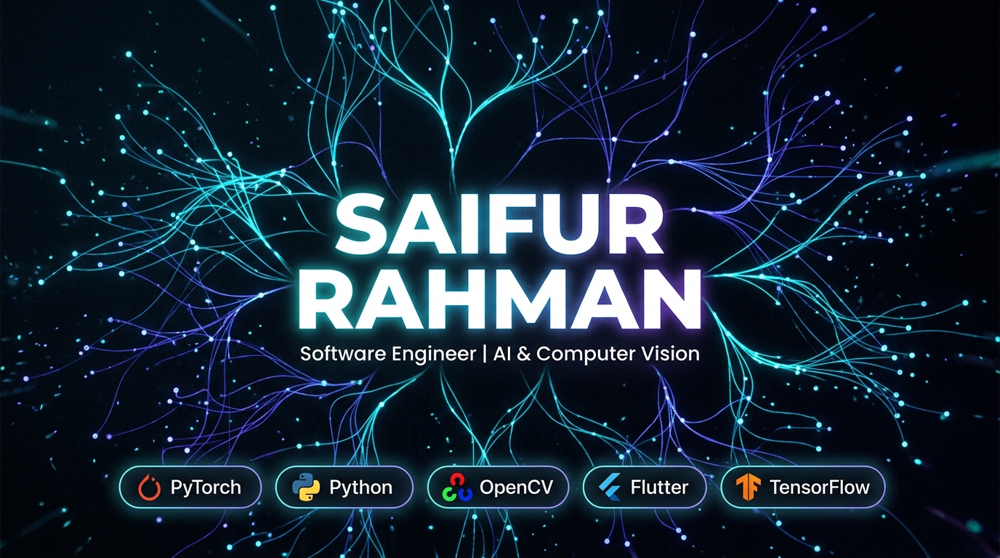

# Saifur Rahman — Personal Portfolio

<div align="center">



[](https://saifur-rahman0.github.io/)
[]()
[]()
[]()

> **AI & Computer Vision Engineer · Flutter Developer · Open-Source Builder**

</div>

---

## Overview

A fully hand-crafted, high-performance personal portfolio website built with **pure Vanilla HTML, CSS, and JavaScript** — zero frameworks, zero build tools, zero dependencies.

Showcasing my work in:
- **AI / Deep Learning / Computer Vision**
- **Cross-Platform Mobile Apps** (Flutter / Dart)
- **Full-Stack Web Development**

---

## Features

| Feature | Description |
|---|---|
| **Aurora Silk Flow Canvas** | Multi-layer animated background — flowing silk ribbon streams, luminous floating orbs with Lissajous drift, and animated hex shimmer grid |
| **Smooth Section Transitions** | Intersection Observer–driven fade/slide reveal on scroll with staggered child animations |
| **Dynamic Theme Toggle** | Dark ↔ Light mode with smooth light-bloom ripple transition animation |
| **Project Modals** | Glassmorphism detail cards with tech stack, highlights, and live/GitHub links |
| **Skill Category Filter** | Animated filter chips for AI, Mobile, Web, and Research project categories |
| **Live Dhaka Clock HUD** | Real-time UTC+6 clock in the hero telemetry bar |
| **Interactive Contact Form** | Client-validated form with `mailto:` launcher and status feedback |
| **Responsive Design** | Mobile-first, works flawlessly from 320px to 4K |
| **Accessibility** | ARIA labels, semantic HTML5, keyboard navigation, reduced-motion support |
| **0% Idle CPU** | Canvas animation auto-pauses via IntersectionObserver when scrolled off-screen |

---

## Tech Stack

```
Frontend   HTML5 · CSS3 (Custom Properties) · Vanilla JavaScript (ES2022)
Fonts      Space Grotesk · Outfit · Fira Code — via Google Fonts
Hosting    GitHub Pages (custom domain via CNAME)
Assets     WebP project covers · SVG icons · PDF resume
```

---

## Project Structure

```
saifur_portfolio/
├── index.html                  # Single-page HTML entry point
├── css/
│   ├── variables.css           # Design tokens, color palette, spacing
│   ├── global.css              # Base resets, layout, aurora orb ambient lights
│   ├── animations.css          # Keyframe animations (aurora drift, hero reveals)
│   ├── components.css          # Navbar, buttons, cards, modals, badges
│   ├── sections.css            # Per-section layout (hero, about, projects, …)
│   ├── section-transitions.css # Scroll-reveal IntersectionObserver styles
│   └── responsive.css          # Breakpoint overrides (768px, 1024px)
├── js/
│   ├── bundle.js               # Unified production JS (all modules inlined)
│   ├── canvas.js               # Aurora Silk Flow canvas source
│   ├── animations.js           # Scroll-reveal, hero typewriter, role-switcher
│   ├── projects.js             # Project data + modal rendering
│   ├── theme.js                # Dark/light theme persistence & toggle
│   └── main.js                 # Module entry point (dev only)
├── assets/
│   ├── images/
│   │   ├── profile.jpg         # Profile photo
│   │   ├── og-preview.jpg      # Open Graph social preview
│   │   └── projects/           # WebP project cover images
│   ├── icons/                  # SVG icons (sun, moon, etc.)
│   └── resume.pdf              # Downloadable CV
└── CNAME                       # GitHub Pages custom domain config
```

---

## Design System

| Token | Value |
|---|---|
| Primary Accent | `#00f2fe` (Cyan) |
| Secondary Accent | `#7928ca` (Violet) |
| Success Accent | `#00ff88` (Emerald) |
| Background Dark | `#030712` |
| Background Light | `#f0f4ff` |
| Font Heading | Space Grotesk |
| Font Body | Outfit |
| Font Mono | Fira Code |

---

## Running Locally

No build tools required. Simply open `index.html` in your browser:

```bash
# Clone the repo
git clone https://github.com/saifur-rahman0/Saifur-Protfolio.git
cd Saifur-Protfolio

# Option A — Direct open
start index.html

# Option B — Quick local server (Python)
python -m http.server 8080
# Then open http://localhost:8080

# Option C — VS Code Live Server
# Install "Live Server" extension → right-click index.html → Open with Live Server
```

---

## Deployment

The site is deployed via **GitHub Pages** with a custom domain.

```
Live URL:  www.saifur-profolio.com
Domain:    Configured via CNAME file
```

To deploy your own fork:
1. Go to **Settings → Pages**
2. Set Source to `main` branch, root `/`
3. (Optional) Add your domain to the CNAME file

---

## Featured Projects

| Project | Domain | Status |
|---|---|---|
| [BdSLW401 Sign Language AI](https://github.com/saifur-rahman0/Bangla-Sign-Language-Word-Recognition) | AI / Computer Vision | 🔬 Research |
| [BdSL Mobile App](https://github.com/saifur-rahman0/BdSL-App) | Mobile (Flutter) | ✅ Production |
| [Guava Disease Detection](https://github.com/saifur-rahman0) | AI / Agriculture | ✅ Production |
| [ETC Apperial Ltd](https://etc-apperial-ltd-client.vercel.app/) | Full-Stack Web | ✅ Live |
| [ShEC Academic Portal](https://github.com/saifur-rahman0) | Web (React/Node) | ✅ Deployed |
| [UMS — University Management](https://github.com/saifur-rahman0) | Web | ✅ Production |

---

## Contact

| | |
|---|---|
| **Email** | rahmansaifur064@gmail.com |
| **GitHub** | [saifur-rahman0](https://github.com/saifur-rahman0) |
| **LinkedIn** | [Md. Saifur Rahman](https://www.linkedin.com/in/saifur-rahman-b8376a268/) |
| **Location** | Dhaka, Bangladesh 🇧🇩 |

